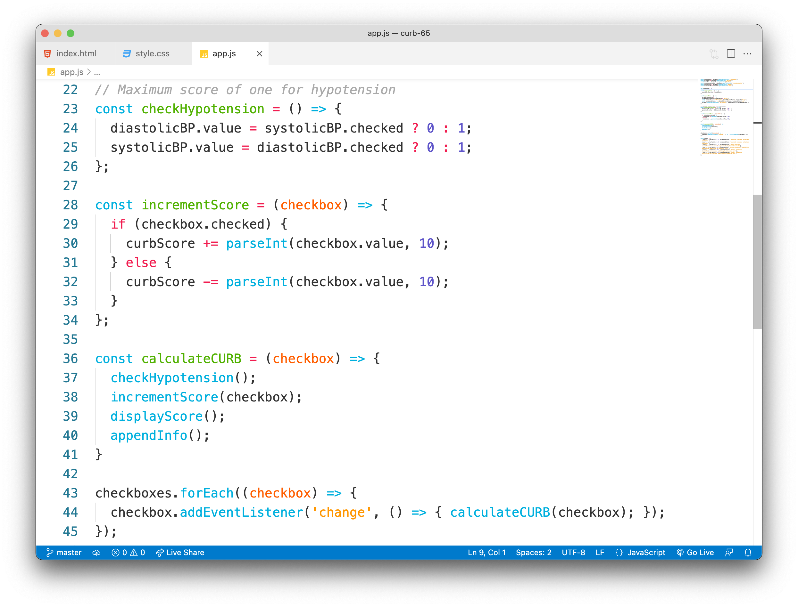

# Monokai Light Theme

A light, bright, minimal theme for VS Code.

Inspired by the default Monokai theme for Sublime Text, with colours adapted for a lighter background.

## Installation

 * Launch the command palette with `ctrl/cmd + shift + p`
 * Run `ext install raeesa.monokai-light`

## Contributing

I've built this theme with Ruby, Javascript, HTML and CSS in mind; if you have any suggestions, feel free to visit the [GitHub repo](https://github.com/raeesahub/monokai-light) and open an issue :)

**Enjoy!**
